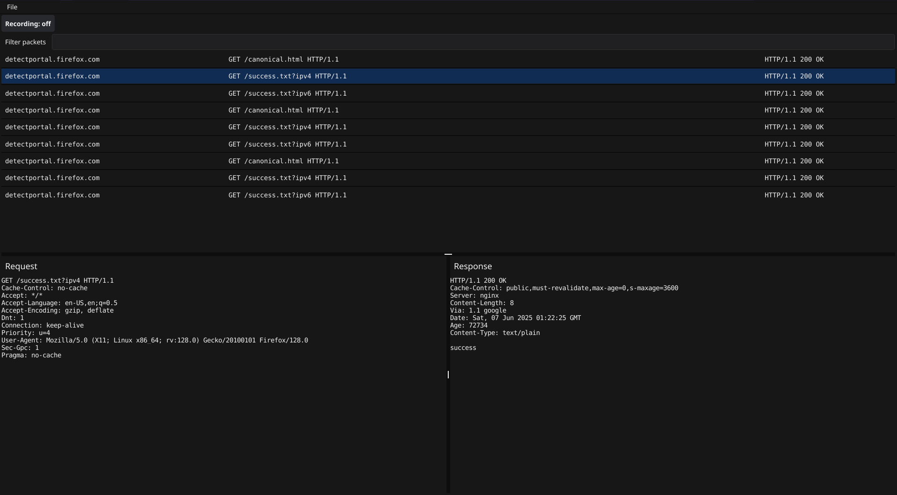

# Gopher in the middle


GITM is a man in the middle proxy that allows inspecting tls encrypted https data. 
It is currently in heavy development. More info to come!

# Screenshot


# Features
- Intercept http and https requests and responses between a client you control, and any server
- Automatically uncompresses many compression types, such as gzip and deflate.
- Decode parts of intercepted packets. Ex: Hex, Base64, urlencoding, etc.
- Save intercepted packets for later analysis, using open humanreadable format (yes, json lol)

Future:
- [ ] Add your own decoding mappings
- [ ] Add your own automatic decompressors or other preprocessors
- [ ] Maybe modify requests and responses in flight???

# Installation
If you have go installed, you can grab the latest version of the package:
```bash
go install github.com/redawl/gitm@latest
```

Or, you can download precompiled binaries from the releases page:
https://github.com/redawl/gitm/releases
