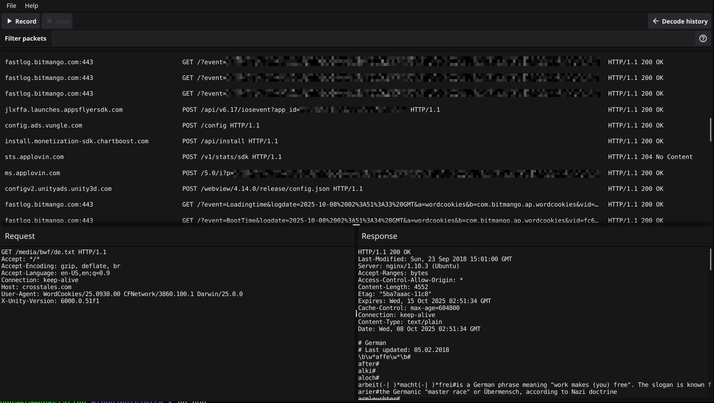

# Gopher in the middle

GITM is a man in the middle proxy that allows inspecting tls encrypted https data. 
It is currently in heavy development. More info to come!

# Screenshot


# Installation
```bash
$ go install github.com/redawl/gitm@latest
```

