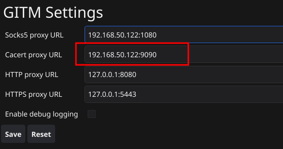
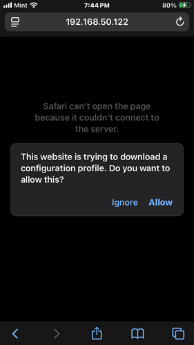
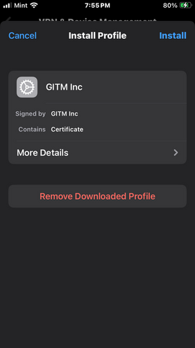
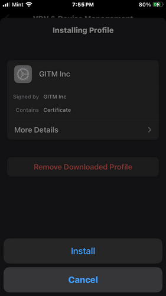
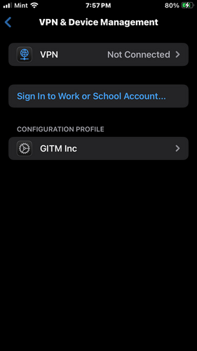

## Setting up gitm on iPhone

1. Install custom CA certificate

GITM contains a webserver that will serve the custom root certificate. We can use this to establish trust between the iPhone and GITM

First, check what the cacert proxy url is in GITM. Make sure it is set to use the ip address on your local network (not localhost or 127.0.0.1):

Then, navigate to "${CACERT_PROXY_URL}/ca.crt" in Safari. You should see the below popup:

Select allow, and open the iPhone settings app. You should see a new "Profile downloaded" option near the top of the app:

Install the profile:

Verify you see the GITM Configuration profile under "VPN Device and management":

Under certificate trust settings, enable the GITM Inc Root certificate. 

2. Configure iPhone to use the socks5 proxy
